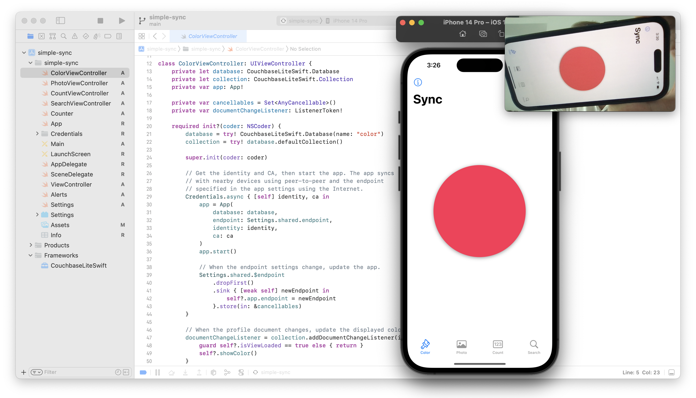

# Simple Sync

Simple Sync is a demonstration of how to read, write, search, and sync data using [Couchbase Lite](https://docs.couchbase.com/couchbase-lite/current/). This repository provides a comprehensive guide to handling different types of data and demonstrates how to synchronize this data across devices, with and without the Internet.

The [Simple Sync](https://apps.apple.com/us/app/simple-color-sync/id6449199482) app is available for download from the App Store. You can download and run the app on your device without any additional setup to see these features in action.

[](https://apps.apple.com/us/app/simple-color-sync/id6449199482)

## Introduction

The code is divided into four major areas, each demonstrating different aspects of data handling and synchronization:

### Color Sync

The `ColorViewController` class manages the color sync feature. It demonstrates how to read, write, and sync simple scalar data, and listen for database changes.

```swift
// Get the "profile1" document from the database collection.
let profile = collection["profile1"].document
// Get the color from the profile.
let color = profile["color"].string

// Update the color.
profile["color"].string = "green"

// Save the document.
collection.save(document: profile)
```

#### Listen for Changes

```swift
// Listen for changes to the profile document.
collection.addDocumentChangeListener(id: "profile1") { change in
    // React to the change.
}
```

### Photo Sync

The `PhotoViewController` class manages the photo sync feature. It demonstrates how to read, write, and sync binary data.

```swift
// Get the "profile1" document from the database collection.
let profile = collection["profile1"].document
// Get the photo from the profile.
let photo = profile["photo"].blob

// Update the photo.
let newPhoto = UIImage(named: "newPhoto")
if let pngData = newPhoto.pngData() {
    profile["photo"].blob = Blob(contentType: "image/png", data: pngData)
}
    
// Save the document.
collection.save(document: profile)
```

### Count Sync

The `CountViewController` class manages the count sync feature. It demonstrates how to read, write, and sync complex data using a CRDT [PN-Counter (Positive-Negative Counter)](https://en.wikipedia.org/wiki/Conflict-free_replicated_data_type#PN-Counter_(Positive-Negative_Counter)).

```swift
// Get the "item1" document from the database collection.
let item = collection["item1"].document
// Get the counter from the item.
var count = item.counter(forKey: "count")

// Increment the count.
count.increment(by: 1)
// Decrement the count.
count.decrement(by: 1)

// Save the document.
collection.save(document: item)
```

### Search

The `SearchViewController` class manages the search feature. It demonstrates how to use Couchbase Lite’s SQL, full-text search, and indexing capabilities.

#### SQL

```sql
SELECT name, image
FROM products
WHERE category = $category AND MATCH(NameColorAndCategoryIndex, $search)
ORDER BY RANK(NameColorAndCategoryIndex), name
```

#### Query

```swift
// Create the query.
let query = database.createQuery(sql)

// Set the query parameters.
query.parameters = Parameters()
    .setString(search, forName: "search")
    .setString(category, forName: "category")

// Execute the query.
let results = query.execute()
```

#### Indexing

```swift
// Create an index on the "name" field for fast sorting.
let nameIndex = ValueIndexConfiguration(["name"])
collection.createIndex(withName: "NameIndex", config: nameIndex)

// Create an index on the "category" field for fast predicates.
let categoryIndex = ValueIndexConfiguration(["category"])
collection.createIndex(withName: "CategoryIndex", config: categoryIndex)

// Create a full-text search index on the "name", "color", and "category" fields.
let ftsIndex = FullTextIndexConfiguration(["name", "color", "category"])
collection.createIndex(withName: "NameColorAndCategoryIndex", config: ftsIndex)
```

## App

The `App` class manages the overall synchronization of the application using Couchbase Lite's sync capabilities. It demonstrates how to sync peer-to-peer and with an endpoint over the internet. The class handles network management, monitoring, and trust verification. 

```swift
// Create the app passing the database to sync, the sync endpoint, and the identity
// and certificate authority for peer-to-peer trust verification.
let app = App(
    database: database,
    endpoint: Settings.shared.endpoint,
    identity: identity,
    ca: ca
)

// Start syncing.
app.start()
```

**NOTE:** The included `gen-credentials.sh` script was used to generate the credentials included with the project. If you want to generate new credentials, run that script again and replace the files in the project's credentials folder with the newly generated files.

## Configure an Endpoint

An endpoint can be hosted using [Couchbase Capella](https://cloud.couchbase.com) or Couchbase Sync Gateway, and connected in the Simple Sync app settings.

### Capella Setup

Start with an existing App Service or create a new one. In the App Service, create and configure the following endpoints:

#### Color

1. Create an App Endpoint named “color”
2. In the App Endpoint, create a user with the Admin Channel “color”
3. Define the Access Control and Data Validation function as:
```javascript
function(doc, oldDoc, meta) {
  if (doc._id !== "profile") {
    throw new Error();
  }
  channel("color");
}
```

#### Photo

1. Create an App Endpoint named “photo”
2. In the App Endpoint, create a user with the Admin Channel “photo”
3. Define the Access Control and Data Validation function as:
```javascript
function(doc, oldDoc, meta) {
  if (doc._id !== "profile") {
    throw new Error();
  }
  channel("photo");
}
```

#### Count

1. Create an App Endpoint named “count”
2. In the App Endpoint, create a user with the Admin Channel “count”
3. Define the Access Control and Data Validation function as:
```javascript
function(doc, oldDoc, meta) {
  if (doc._id !== "item") {
    throw new Error();
  }
  channel("count");
}
```

## Run the Project

1. Clone or download this repository
2. Download the latest [CouchbaseLiteSwift.xcframework](https://www.couchbase.com/downloads/?family=couchbase-lite) and copy it to the project's `Frameworks` directory.
3. Open the project in Xcode.
4. Run the app on two or more simulators, phones, or tablets.
   1. Tap on the `Color` view, then tap the screen. The color will change and sync with other devices.
   2. Tap on the `Photo` view, then tap the screen. The photo will change and sync with other devices.
   3. Tap on the `Count` view, then tap the buttons. The count will change and sync with other devices.
   3. Tap on the `Search` view, then search using name, color, category, and more.



### Source Files

To explore the code, start with the following source files:

* `ColorViewController.swift`: Manages the color sync feature.
* `PhotoViewController.swift`: Manages the photo sync feature.
* `CountViewController.swift`: Manages the count sync feature.
* `SearchViewController.swift`: Manages the search feature.
* `Counter.swift`: Contains the `Counter` and `MutableCounter` classes for managing the CRDT pn-counter, and the `CRDTConflictResolver` class for resolving conflicts.
* `App.swift`: Manages the peer-to-peer and internet endpoint sync features, and handles network monitoring and trust verification.
